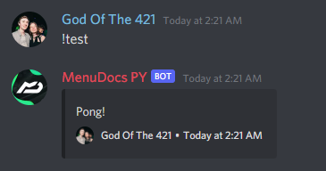

## Nextcord Bot Base


A subclass of `commands.Bot` which implements the following features
and reduces the boilerplate between discord bots.

[https://pypi.org/project/Bot-Base/](https://pypi.org/project/Bot-Base/)

Features
--------

> - Built in persistent blacklist system for both Guilds and Users
>   The bot leaves blacklisted guilds on join and doesn't process
>   commands for anything blacklisted.
> 
> - Built in database using MongoDB with dynamic Document allocation.

```python
import os
from bot_base import BotBase


bot = BotBase(
    command_prefix="!", mongo_url=os.environ["MONGO_URL"], mongo_database_name="my_bot"
)

# Blacklist a guild
bot.blacklist.add_to_blacklist(9876, reason="My enemy!")

# Un-blacklist a guild
bot.blacklist.remove_from_blacklist(9876, reason="I forgave them")

# Blacklist a user
bot.blacklist.add_to_blacklist(12345, reason="My enemy!", is_guild_blacklist=False)

# Un-blacklist a user
bot.blacklist.remove_from_blacklist(12345, reason="I forgave them", is_guild_blacklist=False)
```

---

> All documents are created automatically when first accessed. 
> No need to manually define database Documents anymore.
> 
> Documents are created as class variables on `db`, so anything
> you attempt to access will be created as a Document then used.

```python
import os
from bot_base import BotBase


bot = BotBase(
    command_prefix="!", mongo_url=os.environ["MONGO_URL"], mongo_database_name="my_bot"
)

@bot.event
async def on_ready():
    # Create a document connection to 'config' and get all entries
    configs = await bot.db.config.get_all()
    print(f"{len(configs)} stored guild configs!")
```

---

```python
import os
from bot_base import BotBase


bot = BotBase(
    command_prefix="!", mongo_url=os.environ["MONGO_URL"], mongo_database_name="my_bot"
)

# Get your bots uptime easy peasy
uptime = bot.get_bot_uptime()
```

---

`.prompt(message, *, timeout=60.0, delete_after=True, author_id=None)`
> Easily get back a Yes or No to a given message,
> subclassed context allows for simplified command interactions.

```python
import os
from bot_base import BotBase


bot = BotBase(
    command_prefix="!", mongo_url=os.environ["MONGO_URL"], mongo_database_name="my_bot"
)

@bot.command()
async def check(ctx):
    # Returns True if they click yes, else False
    # Returns None on timeout
    answer = await ctx.prompt("Should I say hi back?")
    if answer:
        await ctx.send("Hi!")
```

---

> The ability to send a basic embed without actually making one
> you can also set embed color, the target to send to, whether
> to display timestamps and the command invoker.

```python
import os
from bot_base import BotBase


bot = BotBase(
    command_prefix="!", mongo_url=os.environ["MONGO_URL"], mongo_database_name="my_bot"
)

@bot.command()
async def ping(ctx):
    await ctx.send_basic_embed("Pong!")
```


---

> Finally, you can also get input from `ctx` cleanly
> with further options for timeouts, whether to
> delete content once a response is gained, etc.

```python
import os
from bot_base import BotBase


bot = BotBase(
    command_prefix="!", mongo_url=os.environ["MONGO_URL"], mongo_database_name="my_bot"
)

@bot.command()
async def echo(ctx):
    # Send an embed with the prompt "What should I say?"
    # before waiting on a response.
    text = await ctx.get_input("What should I say?", delete_after=False)

    if not text:
        return await ctx.send("You said nothing!")

    await ctx.send(text)
```

> Both `ctx.author` and `ctx.channel` also include these methods. 
> However, they do lack some things. (See below)
> 
> The bot features many convenience methods. 
> The following methods exist in order to **Always** get
> the given object or error trying.

```python
await bot.get_or_fetch_user(user_id)
```
- This returns a `User` which includes the above methods.

```python
await bot.get_or_fetch_channel(channel_id)
```
- This returns a `Channel` which includes the above methods 
  with the follow caveats:
    - Both `prompt` and `get_input` require `author_id` for checks
    - `send_basic_embed` will not set footers or timestamps

```python
await bot.get_or_fetch_guild(guild_id)
```
- Simply returns a `nextcord.Guild` object from cache or api

```python
await bot.get_or_fetch_member(guild_object: nextcord.Guild, member_id)
```
- This returns a `Member` which includes the above methods.

Convertors
---

All attempts to use typehints to convert `nextcord.Member`, 
`nextcord.User` and `nextcord.TextChannel` 
will return a wrapped instance of those classes. 
Although the type's are currently playing up so you 
might get autocomplete errors even though it works.

If you wish to fix this, I recommended doing the following.
```python
@bot.command()
async def test(ctx, member: nextcord.Member):
    member: WrappedPerson = member  # noqa

    # Now you have the correct autocomplete for member
```


Optimisation
---

Please note, all wrapped classes are not slotted.